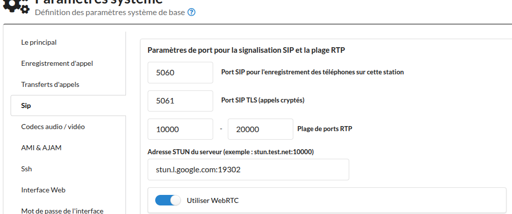
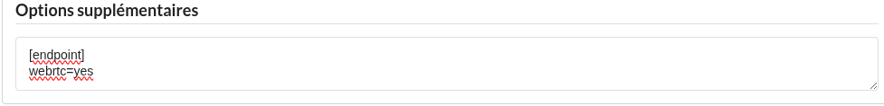
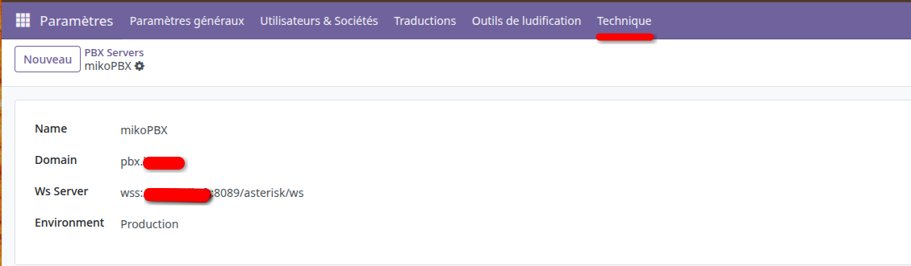
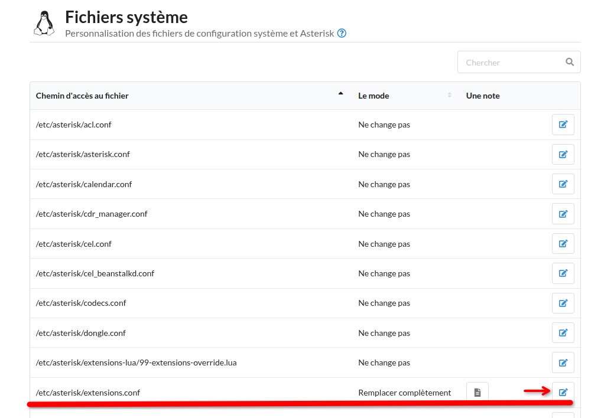

# Connecting Odoo to MikoPBX with `voip_oca` and `base_phone`

This guide walks you through, step by step, how to connect an Odoo instance to a
[MikoPBX](https://mikopbx.com/) server using the OCA modules
[`base_phone`](../../base_phone) and [`voip_oca`](../../voip_oca).

The connection works as follows:

- `base_phone` provides phone-number normalization (E.164) on all partner / user
  records, plus the click-to-dial widgets used in form views.
- `voip_oca` provides the in-browser softphone. It uses [SIP.js](https://sipjs.com/) and
  connects from the **browser** to MikoPBX through a **secure WebSocket** (`wss://`).
  The Odoo backend itself never opens a SIP connection to the PBX, it only stores the
  SIP credentials per user.

> **Prerequisites**
>
> - A running MikoPBX instance.
> - **Both Odoo and MikoPBX must already be served over HTTPS** with a valid,
>   non-self-signed TLS certificate (e.g. Let's Encrypt). Browsers block the `wss://`
>   WebSocket required by SIP.js when the certificate is untrusted or when the Odoo page
>   itself is served over plain HTTP.
> - The modules `base_phone` and `voip_oca` from this repository installed in your Odoo
>   addons path.

---

## 1. Install the Odoo modules

1. Add this repository to your `addons_path`.
2. Install the Python requirements:

   ```bash
   pip install -r base_phone/requirements.txt
   ```

3. In Odoo, enable **Developer mode** (Settings → Developer Tools → Activate developer
   mode).
4. Update the apps list, then install:
   - **Base Phone** (`base_phone`)
   - **VoIP OCA** (`voip_oca`)

---

## 2. Configure MikoPBX

### 2.1 Enable WebRTC in SIP settings

1. In the MikoPBX web interface, go to **General Settings → SIP**.
2. Enable the **Use WebRTC** toggle.
3. In the **STUN server address** field, enter a STUN server (recommended — required
   when Odoo users are behind NAT), for example:

   ```txt
   stun.l.google.com:19302
   ```

4. Click **Save**.

   _Screenshot: General Settings → SIP with WebRTC enabled and STUN configured._

   

The WebSocket endpoint that Odoo will use is:

```
wss://pbx-domain.com:8089/asterisk/ws
```

> MikoPBX exposes this endpoint through its built-in Nginx reverse proxy on port 443 —
> no extra firewall rule needed as long as HTTPS is open.

### 2.2 Create a SIP extension per Odoo user

For every Odoo user that will place / receive calls:

1. In MikoPBX, go to **Telephony → Employees (Extensions) → Add new employee**.
2. Fill in:
   - **Username / Extension number** (e.g. `201`).
   - **SIP password** (auto-generated is fine — copy it, you will need it in Odoo).
3. Under **Transport**, allow **UDP** and **TCP**.
4. In the **Additional Asterisk options** field, add the following to enable WebRTC for
   this extension:

   ```ini
   [endpoint]
   webrtc=yes
   ```

   _Screenshot: extension additional options._

   

5. Save.

## 3. Configure the PBX server in Odoo

1. With Developer mode enabled, go to **Settings → Technical → Discuss → PBX Servers**.
2. Click **New** and fill in:

   | Field       | Value                                                  |
   | ----------- | ------------------------------------------------------ |
   | Name        | `MikoPBX`                                              |
   | Domain      | `pbx.example.com` (the SIP domain / hostname)          |
   | WS Server   | `wss://pbx-domain.com:8089/asterisk/ws`                |
   | Environment | `Test` while you validate, then switch to `Production` |

   > In **Test** mode the SIP.js library is **not** loaded and no registration attempt
   > is made — useful to verify the UI without a real PBX.

   _Screenshot: PBX server form._

   

3. Save.

---

## 4. Configure each Odoo user

Two options are available.

### 4.1 As an administrator (for any user)

1. Go to **Settings → Users & Companies → Users**.
2. Open the user, switch to the **VOIP** tab and set:
   - **PBX Server**: `MikoPBX`
   - **VOIP Username**: the extension number created in MikoPBX (e.g. `201`)
   - **VOIP Password**: the SIP password
3. Save.

### 4.2 As an end user (self-service)

The user can open their **Preferences** (top-right avatar → My Profile) and fill the
same fields under the **VOIP** tab.

---

## 5. Set the company default country (for `base_phone`)

`base_phone` normalizes phone numbers to E.164 using the company country.

1. Go to **Settings → Companies → Companies** and open the active company.
2. Make sure the **Country** is set (e.g. `France`).
3. Save. From now on, any phone number written without a country prefix will be
   reformatted automatically (e.g. `01 55 42 12 42` → `+33155421242`).

---

## 6. (Optional) Normalizing the caller ID for incoming calls (SIP trunk sending `0033` instead of `+33`)

Some SIP trunk providers send the caller ID in the format `0033XXXXXXXXX` instead of the
E.164 format `+33XXXXXXXXX`. Since `base_phone` (via the Python `phonenumbers` library)
normalizes all partner phone numbers to `+33…`, incoming calls won't be matched against
any partner record.

To fix this on the Asterisk side, add a few normalization lines at the beginning of the
incoming call handling, **right after** the `NoOp` line in the `[none-incoming]`
context, inside `/etc/asterisk/extensions.conf`.

In MikoPBX, open the **System files** interface (_System → Customization of system
files_), find `/etc/asterisk/extensions.conf` and switch it to **Replace completely**
mode (copy old and update just after the non-incoming first-lines ).
 Add the
following lines:

```ini
[none-incoming]
exten => XXXXXXXXXXXXXXX,1,NoOp(--- Incoming call ---)
	; --- START OF OUR NORMALIZATION CODE ---
	same => n,ExecIf($["${CALLERID(num):0:2}" = "00"]?Set(CALLERID(num)=+${CALLERID(num):2}))
	same => n,ExecIf($["${CALLERID(name):0:2}" = "00"]?Set(CALLERID(name)=+${CALLERID(name):2}))
	same => n,ExecIf($["${CALLERID(name)}x" == "x"]?Set(CALLERID(name)=${CALLERID(num)}))
	; --- END OF OUR CODE ---
	; … rest of MikoPBX dialplan …
```

> Replace `XXXXXXXXXXXXXXX` with your actual SIP trunk number.

**What each line does:**

| Line                | Purpose                                                                                            |
| ------------------- | -------------------------------------------------------------------------------------------------- |
| `ExecIf(… num …)`   | If `CALLERID(num)` starts with `00`, replaces it with `+` (e.g. `0033612345678` → `+33612345678`). |
| `ExecIf(… name …)`  | Same transformation on `CALLERID(name)` (some providers populate this field instead of `num`).     |
| `ExecIf(… empty …)` | If `CALLERID(name)` is empty, fills it with the normalized value of `CALLERID(num)`.               |

After saving, MikoPBX applies the configuration automatically
(`asterisk -rx "dialplan reload"`). Incoming calls will then arrive with a `+33…` number
and Odoo will be able to match the caller against a partner record.

---

## 7. Going further

- Multiple PBX servers can be defined; each user is bound to one via `voip_pbx_id`.

---

## Resources

- [MikoPBX — Quick start guide](https://docs.mikopbx.com/mikopbx/english/readme/quick-start)
- [MikoPBX — Get SSL certificate with Let's Encrypt](https://docs.mikopbx.com/mikopbx/english/modules/miko/module-get-ssl-lets-encrypt)
- [MikoPBX — Configuring a WebRTC client (Simpl5)](https://docs.mikopbx.com/mikopbx/english/faq/softphones/configuring-webrtc-client-simpl5)

---

## Acknowledgements

Big thanks to the [OCA (Odoo Community Association)](https://odoo-community.org/)
contributors who built and maintain `base_phone` and `voip_oca`. This guide would not
exist without their work.
