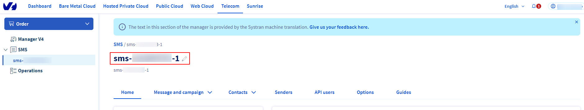
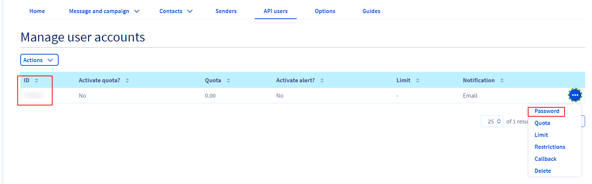
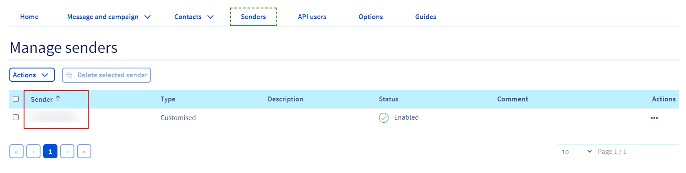

To configure this module, you need to:

- Go to settings \> technical \> IAP Account

- Create a new account with **SMS OVH HTTP** as provider

- Fill your account information as follows:  
  - SMS Account

    

  - API User ID / API User Password

    

  - Sender name

    

  - You can now send an sms!
